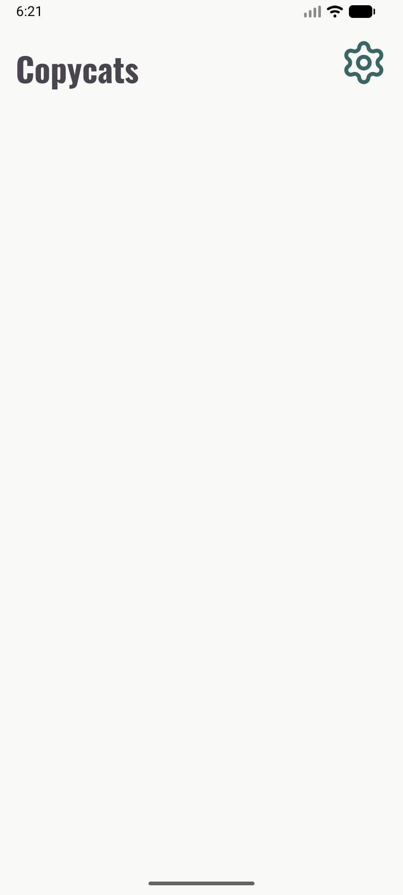
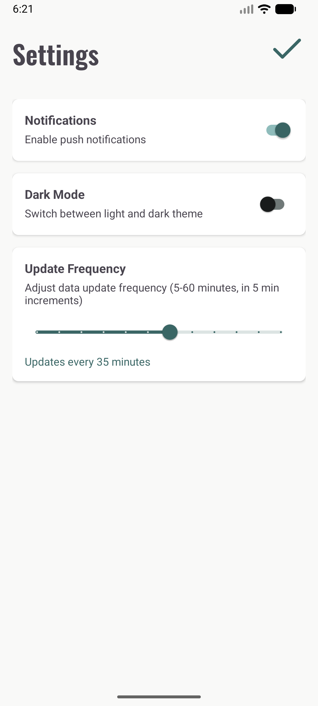
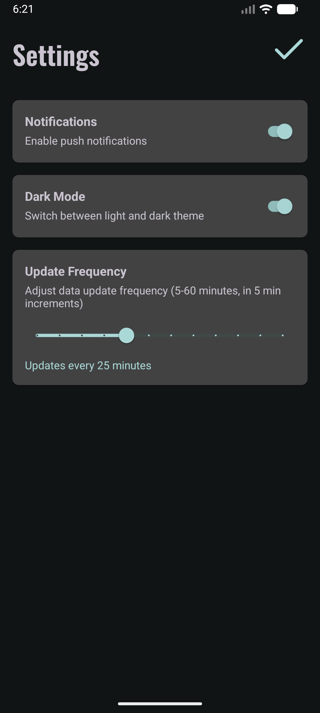

# 1. Poročilo o napredku [PORA]

Senzorji ki jih bomo potrebovali: Lokacija (preverjanje ali je uporabnik na dogodku), Kamera (za zajemanje slike pri ocenitvi števila ljudi [URVRV]), Mikrofon (za zaznavanje glastnosti na dogodku), Pospeškometer (za merjenje števila korakov na dogodkov -> merimo kakšna je aktivnost na dogodku.)

## Commiti

### Anej Bregant

- **feat: inicializacija projekta:**
    Začetni commit in inicializacija projekta, kjer sem ustvaril Empty Views Activity.
- **feat: tema aplikacije & font:**
    S pomočjo Material Theme Builder sem izdelal svojo temo in jo integriral v projekt. Za pisavo smo uporabili Oswald.
- **feat: stran za nastavitve & layout aplikacije & osnovne ikone**
    Naredil sem stran za nastavitve (push notifications, light/dark mode, interval pošiljanja podatkov), prav tako sem aplikacijo zasnoval na fragmentih. Vključil sem potrebne .xml datoteke ikone.

### Tom Li Dobnik

### Alen Kolmanič

## Zaslonske slike

| Homepage | Settings Light | Settings Dark |
|:--------:|:--------------:|:-------------:|
|  |  |  |