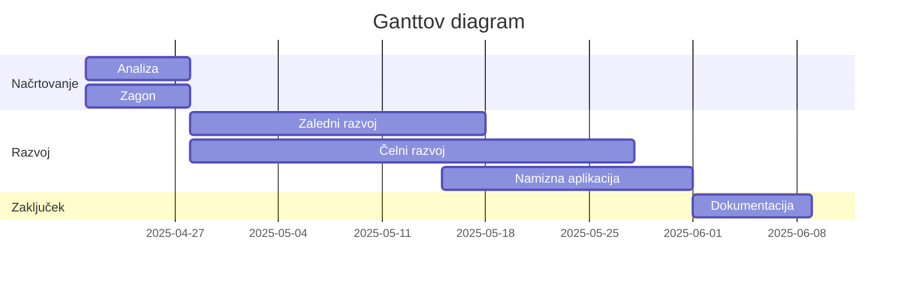
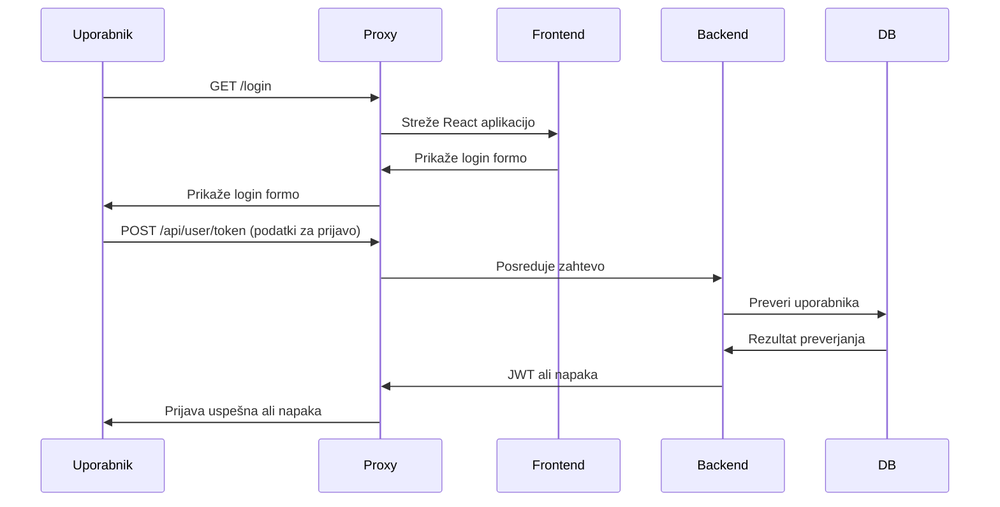
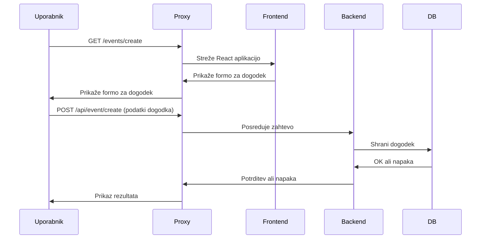
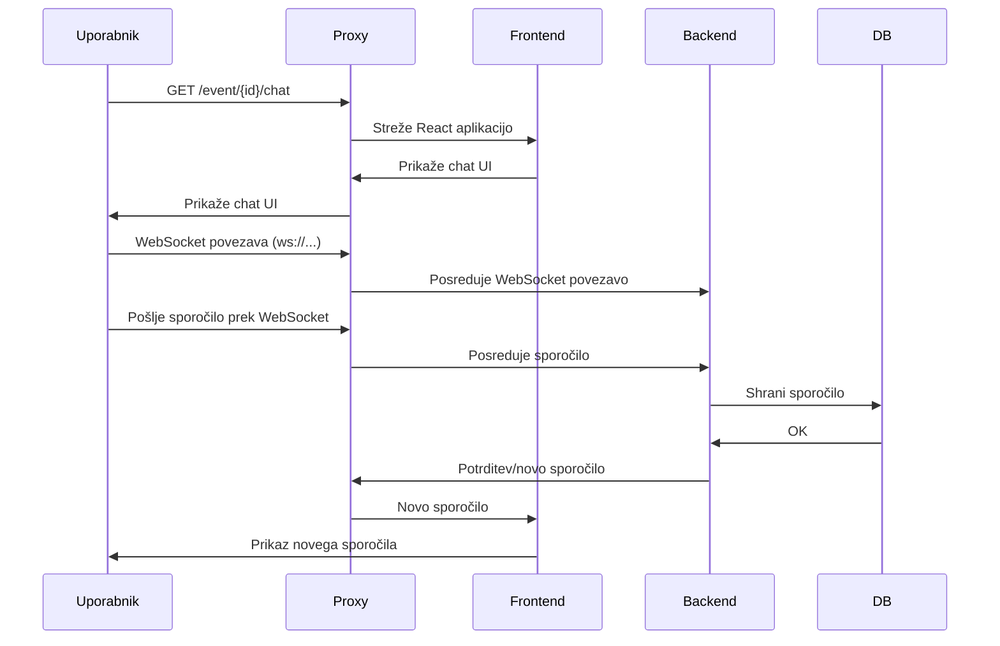
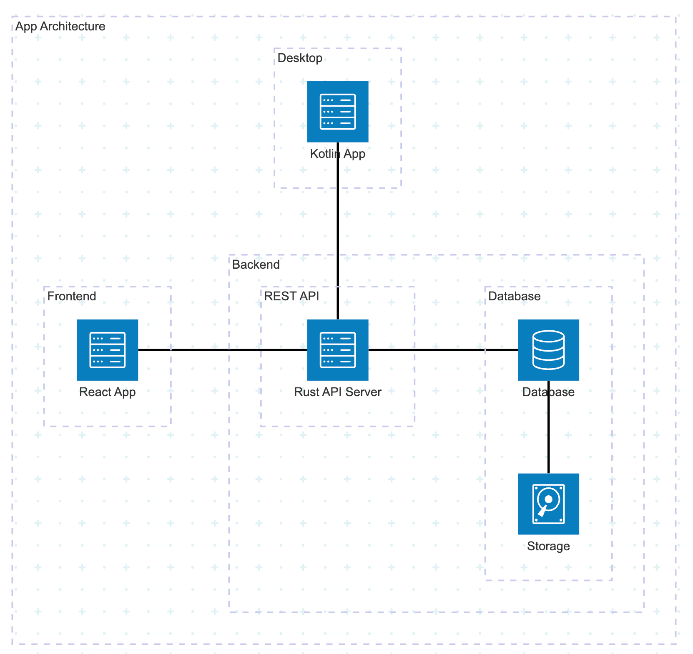
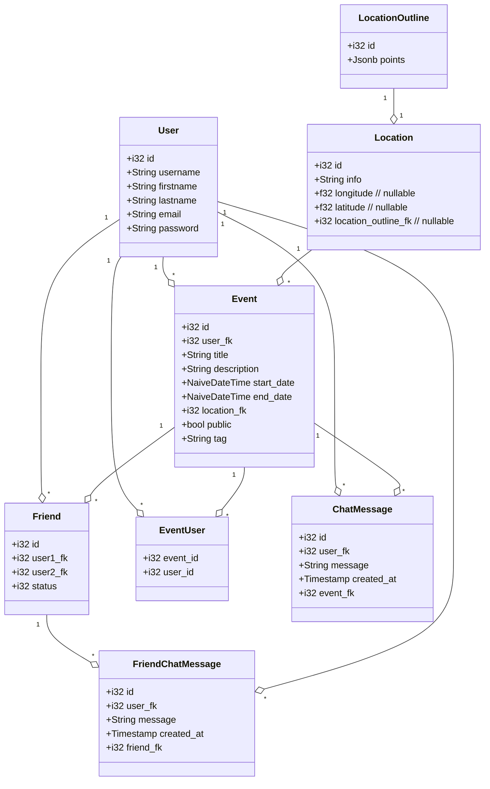
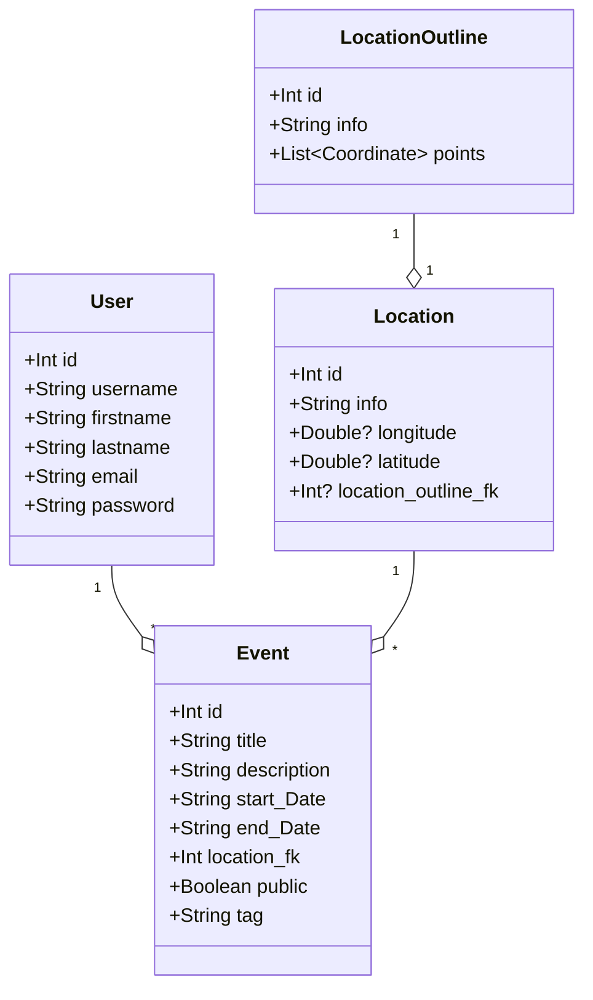
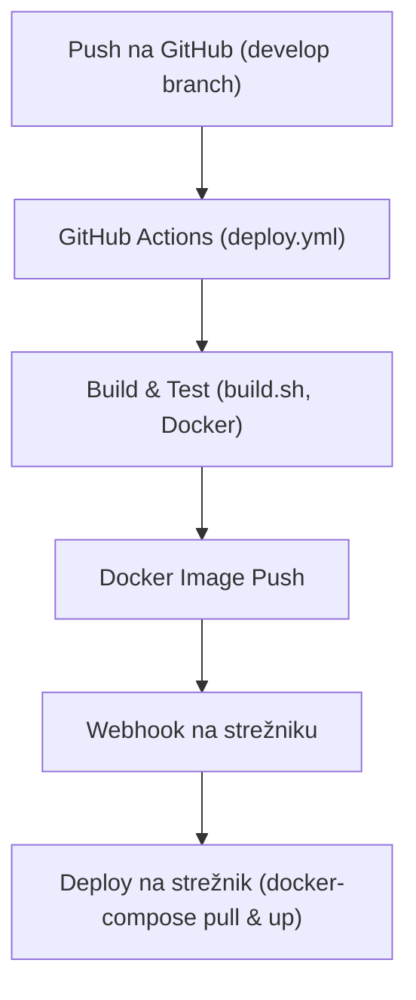

# Dokumentacija

## Prva stran

**Ime projekta:** Copycats

**Člani skupine:**

-   Tom Li Dobnik
-   Alen Kolmanič
-   Anej Bregant

**Povezava do repozitorija:**
[https://github.com/tomlidobnik/FERI-Digitalni-dvojcek](https://github.com/tomlidobnik/FERI-Digitalni-dvojcek)

## Primeri uporabe

**Opis problema:**
Copycats omogoča uporabnikom digitalno povezovanje, organizacijo dogodkov, komunikacijo in deljenje lokacij. Problem rešuje digitalno povezovanje in sodelovanje v realnem času.

### Sekvenčni diagrami za ključne funkcionalnosti

#### 1. Prijava uporabnika

#### 2. Ustvarjanje dogodka

#### 3. Pošiljanje sporočila prek WebSocket

## Arhitektura programske rešitve

### Arhitekturni diagram

**Uporabljene tehnologije:**

-   Programska jezika: Rust (backend), JavaScript/React (frontend)
-   Podatkovna baza: PostgreSQL
-   Komunikacijski protokoli: HTTP/HTTPS, WebSocket
-   Spletni strežnik: Axum (Rust)
-   Prevajalnik: Rustc, Babel (JS)
-   Docker (kontejnerizacija, razvoj in produkcija)
-   Docker Compose (orkestracija več storitev)
-   Nginx (reverse proxy, SSL terminacija)
-   GitHub Actions (CI/CD)
-   FastAPI (webhook za avtomatski deploy)
-   Typst (generiranje PDF dokumentacije)
-   bcrypt (hashiranje gesel)
-   SlowAPI (rate limiting za webhook)
-   GitHub Secrets, Docker Secrets (upravljanje občutljivih podatkov)

**Knjižnice in API:**

-   Diesel (ORM za Rust, delo z bazo)
-   Axum (Rust web framework)
-   React (frontend)
-   JWT (avtentikacija)
-   Tower HTTP (statika, CORS)
-   serde, serde_json (serializacija/deserializacija v Rustu)
-   tokio (asinkrono programiranje v Rustu)
-   tower (middleware za Axum)
-   multer (file upload v Axum)
-   dotenv (upravljanje konfiguracijskih spremenljivk)
-   react-router-dom (navigacija v Reactu)
-   tailwindcss (stiliranje frontend aplikacije)
-   axios (HTTP odjemalec v Reactu)
-   formik, yup (upravljanje in validacija obrazcev v Reactu)
-   react-dropzone (drag & drop upload slik)
-   react-toastify (obvestila v Reactu)
-   ws (WebSocket podpora v Rustu in Reactu)
-   pg (PostgreSQL odjemalec)
-   Zakaj: hitrost, varnost, moderna arhitektura

**Komunikacija:**

-   Čelni del (port 3000)
-   REST API (port 8000)
-   WebSocket (port 8888)
-   HTTPS (TLS certifikati)

### Razredni diagram (Rust)

### Razredni diagram (Kotlin)

## DevOps (CI/CD)

### Potek dela

-   Ob vsakem pushu na vejo `develop` se sproži GitHub Actions workflow (`deploy.yml`).
-   Koda se preveri, zgradi in zapakira v Docker image.
-   Docker image se potisne na Docker Hub.
-   Webhook na strežniku sproži avtomatski deploy (docker-compose pull & up).
-   CI/CD zagotavlja avtomatsko, varno in ponovljivo nameščanje aplikacije.

## Varnost programske rešitve

-   Uporaba požarnega zidu
-   Omejitve uporabnikov (JWT, preverjanje vlog, preverjanje pravic na API endpointih)
-   Varnostne vloge: navaden uporabnik, admin
-   Varovanje podatkov: HTTPS, hashirana gesla (bcrypt), CORS, preverjanje vhodnih podatkov
-   Statika in slike servirane iz ločenega direktorija
-   Rate limiting na webhook endpointu (SlowAPI limiter v Python FastAPI implementaciji)
-   Preverjanje HMAC podpisa na webhook endpointu (varnost pred nepooblaščenimi deployi)
-   Uporaba Docker secretov in GitHub secretov za shranjevanje občutljivih podatkov (gesla, ključi)
-   Ločena okolja za razvoj in produkcijo (različni Dockerfile, različne konfiguracije)
-   Pravilna nastavitev CORS politike na backendu
-   Nginx kot reverse proxy za dodatno plast varnosti in SSL terminacijo
-   Pravilno nastavljeni Docker volumni (podatki baze niso v kontejnerju)
-   Pravilno nastavljene pravice na strežniku (uporabniški dostop, SSH ključi, port forwarding)
-   Samodejno posodabljanje aplikacije le ob preverjenem podpisu (webhook)
