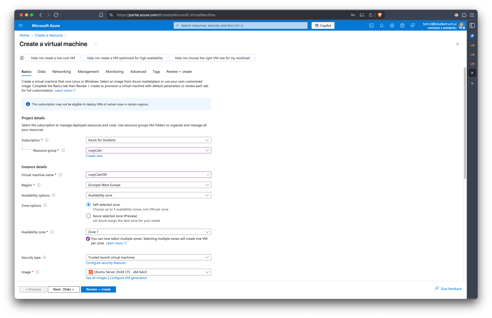
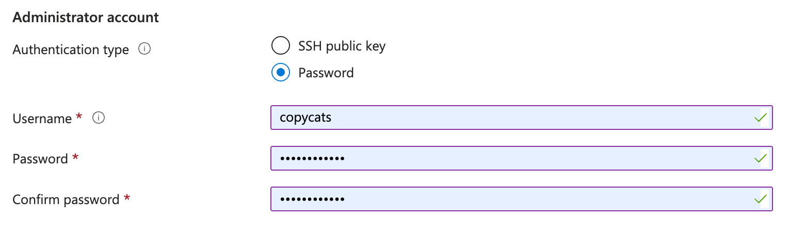
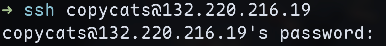
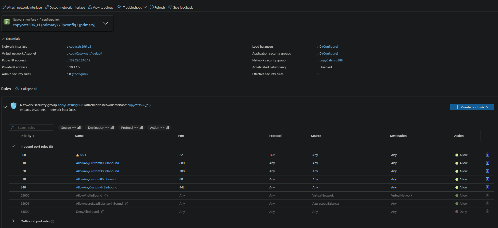
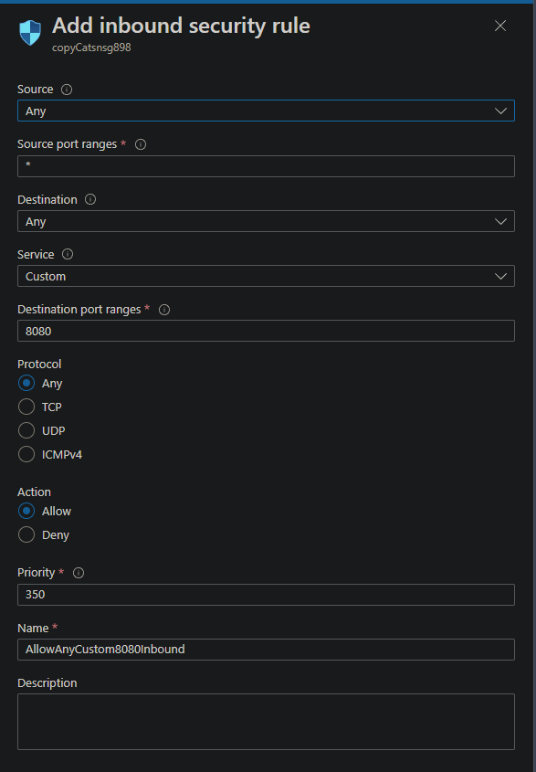
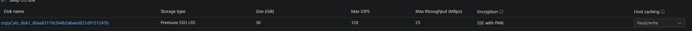
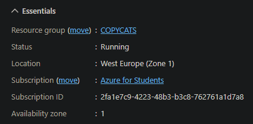
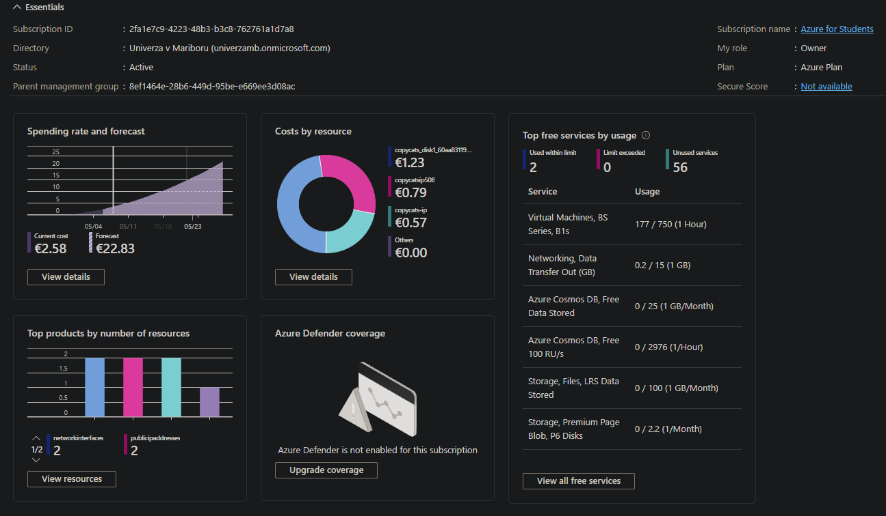

# Poročilo

## Docker slike

### Čelni del

Za čelni del sem ustvaril dve docker sliki: eno za razvojno okolje, kjer se spremembe v kodi lahko takoj vidijo ter eno za produkcijsko okolje, kjer je bolj pomembna optimizacija.

Za razvojno okolje je napisan naslednji dockerfile:

```Dockerfile
FROM node:23-slim

WORKDIR /app

COPY package*.json ./

RUN npm install

COPY . .

EXPOSE 5173

CMD ["npm", "run", "dev"]
```

Z `FROM node:23-slim` določimo verzijo Node.js, v tem primeru 23, "slim" pa pomeni, da bo osnovna slika majhna, kar zmanjša velikost končne slike.<br>
`WORKDIR /app` nastavi delovno mapo na /app, vsi naslednji ukazi se bodo izvajali na to mapo.<br>
`COPY package*.json ./` kopira package.json in package-lock.json iz lokalnega direktorija v mapo /app v "kontejneru". To nam omogoča ločeno nameščanje odvisnosti (dependencies), brez kopiranja celotnega projekta, kar nam pomaga pri boljši uporabi Docker predpomnilnika.<br>
`RUN npm install`, zažene ukaz za namestitev vseh NPM odvisnosti, ki so navedene v package.json. To pripravi aplikacijo za zagon.<br>
`COPY . .` kopira celotno vsebino trenutnega imenika v /app "konterjneru".<br>
`EXPOSE 5173` pove Docker-ju, da posluša na port-u 5173.<br>
`CMD ["npm", "run", "dev"]` zažene ukaz npm run dev, s čimer zaženemo Vite.<br><br>
Za produkcijsko okolje je napisan naslednji dockerfile:

```Dockerfile
FROM node:23-alpine AS build

WORKDIR /app

COPY package*.json ./
RUN npm ci --legacy-peer-deps

COPY . .
ENV VITE_API_URL=132.220.216.19
RUN npm run build

FROM node:23-alpine

WORKDIR /app

RUN npm install -g serve

COPY --from=build /app/dist ./dist

EXPOSE 3000

CMD ["serve", "-s", "dist"]
```
`FROM node:23-alpine AS build`, tukaj uporabimo Node.JS sliko "Alpine" (majhna verzija Alpine Linux). Damo tudi ime "build", da lahko to potem tudi uporabimo<br>
`WORKDIR /app` nastavi delovno mapo na /app, vsi naslednji ukazi se bodo izvajali na to mapo.<br>
`COPY package*.json ./` kopira package.json in package-lock.json iz lokalnega direktorija v mapo /app v "kontejneru".<br>
`RUN npm ci --legacy-peer-deps`, s tem namestimo odvistnosti z npm ci. "--legacy-peer-deps" ignorira "peer dependancy" konflikte.<br>
`COPY . .` kopira celotno vsebino trenutnega imenika v /app "konterjneru".<br>
`ENV VITE_API_URL=132.220.216.19` določimo okoljsko spremenljivko, ki jo bo Vite prebral med grajenjem.<br>
`RUN npm run build` zažene Vite build, ki ustvari optimizirano verzijo aplikacije v mapi "dist".<br>
`FROM node:23-alpine` zaženemo novo čisto Node.JS Alpine sliko.<br>
`WORKDIR /app`, ponovno nastavimo delovni direktorij.<br>
`RUN npm install -g serve`, namestimo "serve", majhen HTTP strežnik za serviranje statične vsebine.<br>
`COPY --from=build /app/dist ./dist` kopiramo "dist" direktorij iz prve faze (build) v drugo.
S tem dobimo končno zgrajeno aplikacijo, brez nepotrebne kode in orodij za razvoj.<br>
`EXPOSE 3000` pove Docker-ju, da posluša na port-u 3000.<br>
`CMD ["serve", "-s", "dist"]` zaženemo aplikacijo s "serve", ki statično servira datoteke iz "dist" direktorija. "-s" pomeni single-page app, vse neznane poti bodo vračale index.html.<br>


Pri obeh dockerfilih se uporablja node za okolje, nato se pri obeh tudi naredi layer caching s tem, da najprej kopiramo package.json in package-lock.json. Največja razlika je, da v razvijalnem okolju uporabimo ukaz `npm run dev`, da imamo razvojno verzijo čelnega dela, medtem ko v produkcijskem okolju zgradimo aplikacijo in jo z ukazom `serve -s dist` izvajamo.

### Zaledni del

Tako kot za čelni del je tudi na zalednem delu ločeno okolje za produkcijo in razvoj.

Za razvojno okolje je napisan naslednji dockerfile:

```Dockerfile
FROM rust:slim

RUN apt-get update && apt-get install -y libpq-dev pkg-config && \
    cargo install cargo-watch && \
    apt-get clean && rm -rf /var/lib/apt/lists/*

WORKDIR /usr/src/backend

COPY Cargo.toml Cargo.lock ./
RUN mkdir src && echo "fn main() {}" > src/main.rs
RUN cargo fetch

COPY . .

CMD ["cargo", "watch", "-x", "run"]
```
`FROM rust:slim` je osnovna slika, ki vsebuje Rust. "Slim" pomeni, da gre za minimalno Debian osnovo. To je manjša velikost slike, hitrejši "build"...<br>
`RUN apt-get update && apt-get install -y libpq-dev pkg-config && \
    cargo install cargo-watch && \
    apt-get clean && rm -rf /var/lib/apt/lists/*` naredi naslednje:<br>
    - `apt-get`: posodobi seznam paketov, ki so na voljo.<br>
    -  `apt-get install -y libpq-dev pkg-config`: namesti libpq-dev, potrebno za povezavo s PostgreSQL. Namesti tudi pkg-configm, ki je orodje za iskanje poti in zastavic za sistemske knjižnice.<br>
    - `cargo install cargo-watch`: namestimo orodje "cargo-watch", ki samodejno prevede in zažene kodo ob spremebah datotek.<br>
    - `apt-get clean && rm -rf /var/lib/apt/lists/*`: Počisti predpomnilnik, da zmanjša velikost slike. <br>
`WORKDIR /usr/src/backend` nastavi delovno mapo v "kontejneru" /usr/src/backend. Tukaj bodo izvajani vsi naslednji ukazi.<br>
`COPY Cargo.toml Cargo.lock ./` kopira Cargo.toml in Cargo.lock v delovno mapo.<br>
`RUN mkdir src && echo "fn main() {}" > src/main.rs` ustvari začasno mapo src/ z main.rs. Potrebno ker "cargo fetch" zahteva prisotnost vsaj ene validne datoteke.<br>
`RUN cargo fetch` prenese vse Rust odvisnosti določene v "Cargo.toml" datoteki.<br>
`COPY . .` kopira celoten preostali projekt v "kontejner".<br>
`CMD ["cargo", "watch", "-x", "run"]` zažene ukaz "cargo watch -x run". Pomeni da bo cargo spremljal spremembe v datotekah in ob vsaki spremembi zagnal "cargo run".<br>

Za razvojno okolje najprej posodobimo pakete in naložimo pakete, če še niso naloženi, nato pa s kopiranjem `Cargo.toml` in `Cargo.lock` omogočimo preprosti layer caching in nato izvedemo ukaz `cargo watch -x run`, da se nam ob spremembah v kodi avtomatsko zgradi aplikacija.

Za produkcijsko okolje je napisan naslednji dockerfile:

```Dockerfile
FROM lukemathwalker/cargo-chef:latest-rust-1 AS chef
WORKDIR /app

FROM chef AS planner
COPY . .
RUN cargo chef prepare --recipe-path recipe.json

FROM chef AS builder
COPY --from=planner /app/recipe.json recipe.json
RUN cargo chef cook --release --recipe-path recipe.json

COPY . .
RUN cargo build --release --bin backend

FROM debian:bookworm-slim AS runtime
WORKDIR /app

RUN apt-get update && apt-get install -y libpq5 ca-certificates && \
    apt-get clean && rm -rf /var/lib/apt/lists/*

COPY --from=builder /app/target/release/backend /usr/local/bin/app

EXPOSE 8000
ENTRYPOINT ["/usr/local/bin/app"]
```
`FROM lukemathwalker/cargo-chef:latest-rust-1 AS chef` uporabimo pripravljeno sliko, ki vsebuje Rust in orodje "cargo-chef". Dodelimo ime "chef".<br>
`WORKDIR /app` nastavimo delovno mapo.<br>
`FROM chef AS planner`, ustvarimo novo fazo planner, ki uporablja chef.<br>
`COPY . .`, kopiramo celoten projekt.<br>
`RUN cargo chef prepare --recipe-path recipe.json`, generira "recipe.json". Opis vseh odvisnosti, brez uporabniške kode.<br>
`FROM chef AS builder`, faza builder, ki nadaljuje z uporabo "cargo-chef".<br>
`COPY --from=planner /app/recipe.json recipe.json`, kopira "recipe.json" iz prejšnje faze.<br>
`RUN cargo chef cook --release --recipe-path recipe.json`, prevede vse odvisnosti brez uporabniške kode.<br>
`COPY . .`, kopiramo vso kodo<br>
`RUN cargo build --release --bin backend`, naredimo dejanski build naše aplikacije v "release" načinu.<br>
`FROM debian:bookworm-slim AS runtime`, nova slika iz uradne minimalne Debian distribucije.<br>
`WORKDIR /app`, naredimo delovno mapo.<br>
`RUN apt-get update && apt-get install -y libpq5 ca-certificates && \
    apt-get clean && rm -rf /var/lib/apt/lists/*`, namestimo "libpq5" za povezavo z PostgreSQL. "ca-certificates" omogoča varne HTTPS povezave. Na koncu še počistimo začasne datoteke da zmanjšamo velikost slike.<br>
`COPY --from=builder /app/target/release/backend /usr/local/bin/app`, kopiramo preveden "backend" iz builder faze v končno sliko. Ime programa bo /usr/local/bin/app. <br>
`EXPOSE 8000`, "kontejner" bo poslušal na port-u 8000.<br>


Za razvojno okolje je bolj napredni dockerfile, zato ker lahko v rust naredimo veliko optimizacij, da prihranimo s časom. Najprej naredim napredni layer caching, da ob ponovnem zagonu prevedemo samo novo dodane pakete, s tem prihranimo veliko časa, saj je rust znan po počasnem prevajanju. Nato naložimo in posodobimo pakete in na koncu izvedemo zgrajeno aplikacijo.

### Docker compose

S pomočjo docker composa povežemo slike ter tudi dodamo podatkovno bazo. V `docker-compose.yml` imam naslednjo konfiguracijo:

```yml
services:
  db:
    image: postgres:15-alpine
    restart: always
    environment:
      POSTGRES_USER: user
      POSTGRES_PASSWORD: password
      POSTGRES_DB: db
    volumes:
      - db_data:/var/lib/postgresql/data
    ports:
      - "5433:5432"

  backend-dev:
    build:
      context: ./backend
      dockerfile: Dockerfile.dev
    restart: always
    environment:
      DATABASE_URL: postgres://user:password@db:5432/db
      RUST_LOG: debug
    volumes:
      - ./backend:/usr/src/backend
    command: cargo watch -x run
    depends_on:
      - db
    ports:
      - "8000:8000"

  backend-prod:
    build:
      context: ./backend
      dockerfile: Dockerfile
    restart: always
    environment:
      DATABASE_URL: postgres://user:password@db:5432/db
      RUST_LOG: info
    depends_on:
      - db
    ports:
      - "8000:8000"
    volumes:
      - ./backend/.env:/app/.env:ro

  frontend-dev:
    build:
      context: ./frontend
      dockerfile: Dockerfile.dev
    restart: always
    volumes:
      - ./frontend:/app
      - /app/node_modules
    ports:
      - "5173:5173"
    stdin_open: true
    tty: true
    command: npm run dev

  frontend-prod:
    build:
      context: ./frontend
      dockerfile: Dockerfile
    restart: always
    ports:
      - "3000:3000"

volumes:
  db_data:
```

<b>Najprej imamo db, ki je namenjen podatkovni bazi PostgreSQL:</b><br>
`image: postgres:15-alpine`, uporabljamo verzijo 15, na Alpine Linux-u.

`restart: always`, vedno se znova zažene, če gre kaj narobe ali če Docker pade.

`environment`: inicializiramo bazo z uporabnikom, geslom in bazo db<br>
  &nbsp;&nbsp;&nbsp;`POSTGRES_USER`: user<br>
  &nbsp;&nbsp;&nbsp;`POSTGRES_PASSWORD`: password<br>
  &nbsp;&nbsp;&nbsp;`POSTGRES_DB`: db

`volumes`: trajno shranimo bazo znotraj Docker volume "db_data<br>
&nbsp;&nbsp;&nbsp; - db_data:/var/lib/postgresql/data

`ports`:povežemo lokalni port 5433 na "kontejnerjev" 5432.<br>
&nbsp;&nbsp;&nbsp;- "5433:5432"<br>

<b>Nato imamo zaledni del za razvoj, z Rust.</b><br>
`build`: zgradi z Dockerfile.dev iz mape ./backend<br>
  &nbsp;&nbsp;&nbsp;context: ./backend<br>
  &nbsp;&nbsp;&nbsp;dockerfile: Dockerfile.dev<br>

`environment`: uporablja se za povezavo do baze<br>
  DATABASE_URL: postgres://user:password@db:5432/db <br>
  RUST_LOG: debug (uporabljamo debug logging)<br>

`volumes`: lokalno kodo lahko povežemo direktno v "konterjner", kar omogoča "hot reload", torej lahko vidimo spremembe datotek takoj.<br>
&nbsp;&nbsp;&nbsp; - ./backend:/usr/src/backend<br>

`command`: cargo watch -x run, spremljamo spremembe in znova zaženemo aplikacijo<br>

`depends_on`: zažene zaledni del šele, ko je baza zagnana.<br>
&nbsp;&nbsp;&nbsp;- db

`ports`: port za lokalni dostop<br>
  &nbsp;&nbsp;&nbsp;- "8000:8000"

<b>Naslednje je zaledni del za produkcijo, z Rust:</b><br>
`build`: zgradimo z Dockerfile<br>
  &nbsp;&nbsp;&nbsp;context: ./backend<br>
  &nbsp;&nbsp;&nbsp;dockerfile: Dockerfile

`restart`: always, enako kot pri zalednem delu za razvoj, le da imamo manj vnosov v logih (info namesto debug)<br>
`environment`:
  &nbsp;&nbsp;&nbsp;DATABASE_URL: postgres://user:password@db:5432/db<br>
  &nbsp;&nbsp;&nbsp;RUST_LOG: info<br>
`depends_on`:<br>
&nbsp;&nbsp;&nbsp;- db<br>
`ports`:<br>
  &nbsp;&nbsp;&nbsp;- "8000:8000"

`volumes`:
 &nbsp;&nbsp;&nbsp; - ./backend/.env:/app/.env:ro, "mountamo" .env datoteko, samo za branje. Uporabljamo za konfiguracijo.

<b> Naslednjo je Vite čelni del za razvoj:</b><br>
`build`: zgradi z Dockerfile.dev iz frontend mape<br>
  &nbsp;&nbsp;&nbsp;context: ./frontend<br>
  &nbsp;&nbsp;&nbsp;dockerfile: Dockerfile.dev

`volumes`: "mount" za kodo (./frontend) in ločen mount za node_modules<br>
  &nbsp;&nbsp;&nbsp;- ./frontend:/app<br>
  &nbsp;&nbsp;&nbsp;- /app/node_modules

`ports`: port za Vite<br>
  &nbsp;&nbsp;&nbsp;- "5173:5173"

`stdin_open`: true, omogoča "hot reloading"<br>
`tty`: true

`command`: npm run dev, zažene ukaz za zagon Vite strežnika.

<b> Nato je Vite čelni del za produkcijo:</b><br>
  `build`: uporabimo Dockerfile za grajenje aplikacije<br>
    &nbsp;&nbsp;&nbsp;context: ./frontend<br>
    &nbsp;&nbsp;&nbsp;dockerfile: Dockerfile

`ports`: port za Vite<br>
   &nbsp;&nbsp;&nbsp;-"3000:3000"

<b>Na koncu pa imamo še "volumes":</b><br>
`volumes`: imamo lokalni volumen za PostgreSQL, da se podatki ohranijo po izklopu "kontejnera".<br>
  &nbsp;&nbsp;&nbsp;db_data:


Zdaj lahko z ukazom

```sh
docker-compose up --build db backend-prod frontend-prod
```

sestavimo svojo okolje za produkcijo.

Z ukazom

```sh
docker-compose up --build db backend-dev frontend-dev
```

pa si sestavimo razvijalno okolje.

Da preverimo ali vse deluje normalno izvedemo ukaz `docker ps`, kjer bi naj videli, da se izvajajo 3 kontainerji.

Z ukazom `docker compose down` pa ustavimo okolje.

## Azure strežnik

### Ustvarjanje

Na spletnem portalu Microsoft Azure sem se najprej prijavil s študentskim mailom, nato sem začel z ustvarjanjem virtualnega stroja.


Tukaj sem pustil večina privzetih nastavitev, spremenil pa sem naslednje nastavitve:

- Resource group -> copyCats
- Authentication type -> Password
- Nastavil username in password za VM.



### Konfiguracija

Na strežniku je bilo potrebno naložiti in konfigurirati nginx.

Najprej sem se povezal na strežnik z `ssh`.



Nato sem izvedel naslednje ukaze za nalaganje nginx:

```sh
sudo apt install nginx # naložil nginx
sudo systemctl enable nginx # aktiviral nginx
sudo systemctl start nginx # vklopil nginx
```

Potrebno je še samo nastaviti nginx konfiguracijo.

Zato sem nastavil nastavitve v `/etc/nginx/sites-available/default` na:

```config
server {
        server_name 132.220.216.19; # Naslov Azure strežnika

        # Posredniški strežnik za zaledni del
        location /api/ {
                proxy_pass https://localhost:8000;

                proxy_ssl_verify off;

                proxy_http_version 1.1;
                proxy_set_header Host $host;
                proxy_set_header X-Real-IP $remote_addr;
                proxy_set_header X-Forwarded-For $proxy_add_x_forwarded_for;
                proxy_set_header X-Forwarded-Proto $scheme;
        }

        # Posredniški strežnik za čelni del
        location / {
                proxy_pass http://localhost:3000;

                proxy_http_version 1.1;
                proxy_set_header Upgrade $http_upgrade;
                proxy_set_header Connection "upgrade";
                proxy_set_header Host $host;
                proxy_set_header X-Real-IP $remote_addr;
                proxy_set_header X-Forwarded-For $proxy_add_x_forwarded_for;
                proxy_set_header X-Forwarded-Proto $scheme;
        }
}
```
<b>Zaledni del:</b><br>
`server_name` 132.220.216.19; Nginx bo sprejemal zahtevke, poslane na ta IP

`location /api/` { Vse zahteve, ki začnejo z /api/, bodo preusmerjene na lokalni strežnik na portu 8000<br>
&nbsp;&nbsp;&nbsp;`proxy_pass` https://localhost:8000;

`proxy_ssl_verify` off; Izklopi preverjanje TLS certifikata

`proxy_http_version` 1.1; http verzija 1.1<br>
`proxy_set_header` Host $host; ohranimo originalno gostiteljsko ime

X-Real-IP ter X-Forwarded-For omogočita zalednemu delu prepoznavo pravega IP-ja "clienta"<br>
`proxy_set_header` X-Real-IP $remote_addr;<br>
`proxy_set_header` X-Forwarded-For $proxy_add_x_forwarded_for;

`proxy_set_header` X-Forwarded-Proto $scheme; ali je bil zahtevek HTTP ali HTTPS<br>

<b>Čelni del:</b><br>
`location /` { Vse preostale zahteve bodo preusmerjene na lokalni strežnik na portu 3000<br>
&nbsp;&nbsp;&nbsp;`proxy_pass` http://localhost:3000;

`proxy_http_version` 1.1; verzija http 1.1

Omogoča WebSocket podporo za "hot reloading" in druge zadeve. `Upgrade` in `Connection: upgrade` omogočata preklop HTTP na WebSocket protokol.<br>
`proxy_set_header` Upgrade $http_upgrade;<br>
`proxy_set_header` Connection "upgrade";

Enako kot pri zalednem delu se ti ukazi uporabljajo za ohranjanje informacij o izvorni zahtevi.<br>
`proxy_set_header` Host $host;<br>
`proxy_set_header` X-Real-IP $remote_addr;<br>
`proxy_set_header` X-Forwarded-For $proxy_add_x_forwarded_for;<br>
`proxy_set_header` X-Forwarded-Proto $scheme;


### Vzpostavitev dockerja

Najprej izvedem naslednje ukaze:

```sh
sudo apt-get update
sudo apt-get install ca-certificates curl
sudo install -m 0755 -d /etc/apt/keyrings
sudo curl -fsSL https://download.docker.com/linux/ubuntu/gpg -o /etc/apt/keyrings/docker.asc
sudo chmod a+r /etc/apt/keyrings/docker.asc

echo \
  "deb [arch=$(dpkg --print-architecture) signed-by=/etc/apt/keyrings/docker.asc] https://download.docker.com/linux/ubuntu \
  $(. /etc/os-release && echo "${UBUNTU_CODENAME:-$VERSION_CODENAME}") stable" | \
  sudo tee /etc/apt/sources.list.d/docker.list > /dev/null
sudo apt-get update
```

Nato pa naložim potrebna docker orodja

```sh
sudo apt-get install docker-ce docker-ce-cli containerd.io docker-buildx-plugin docker-compose-plugin
```

Poleg tega tudi potrebujemo git.

```sh
sudo apt install git
```

Nato izvedemo naslednje ukaze, da naložimo repozitorij in začnemo proukicijsko okolje:

```sh
git clone https://github.com/tomlidobnik/FERI-Digitalni-dvojcek
cd FERI-Digitalni-dvojcek
docker compose up
```

## Odgovori na vprašanja

### Kje in kako omogočite "port forwarding" ?

Na domači strani pod "Networking" kliknemo na "Network settings". Nato lahko ustvarimo nova pravila pri katerih lahko nastavimo iz katerih vrat bomo preusmerjali v druga vrata in še druge nastavitve.




### Kakšen tip diska je bil dodan vaši navidezni napravi in kakšna je njegova kapaciteta ?

- tip: Premium SSD LRS
- kapaciteta: 30 GB



### Kje preverimo stanje trenutne porabe virov v naši naročnini ("Azure for students") ?

Na domači strani kliknemo na "Overview", nato pod "Essentials" lahko najdemo "Subscription" in ko kliknemo na link lahko preverimo stanje trenutne uporabe v naši naročnini.


